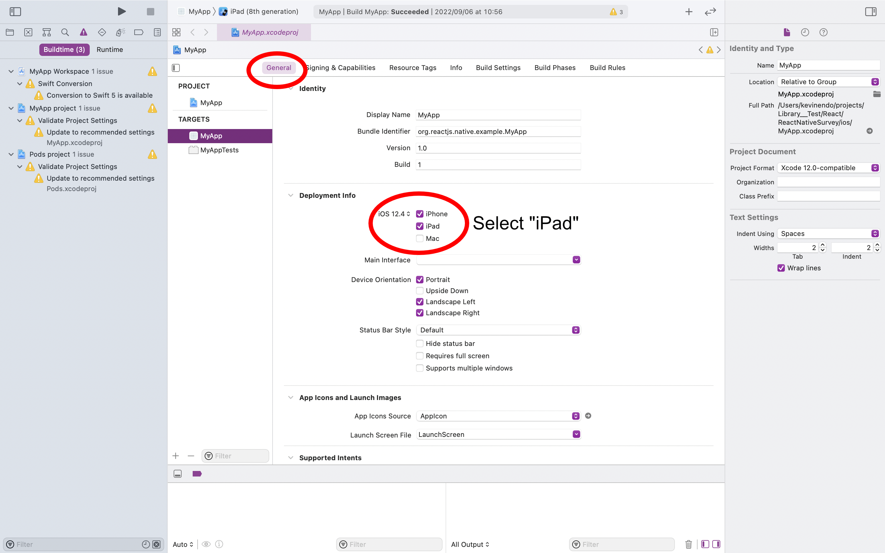
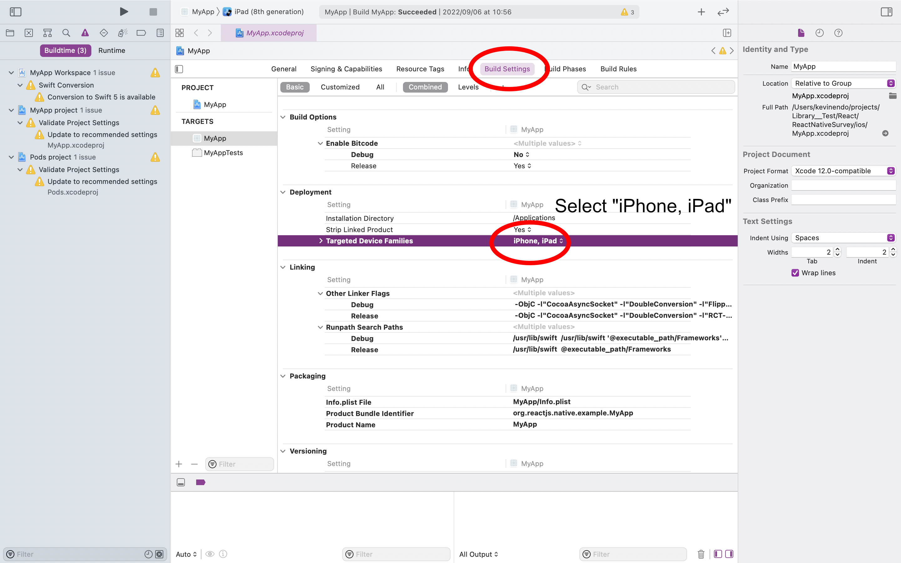

# React Native / Native Module Survey

## Requirements

1. Node: v16.6.1~ (brew install node)
2. Xcode (apple store)
3. watchmen: 2022.08.29.00~ (brew install watchman)
---
&nbsp;
## Install dependencies
```bash
# directory: ReactNativeSurvey/
$ npm install
```

## Xcode Settings
### 1. open Xcode
```bash
# select "Open a project or file"
# select ReactNativeSurvey/ios/
```
---
&nbsp;

### 1.General > Deployment info > "iPad"


### 2. Build Settings > Deployment

---
&nbsp;

## Run
### Step 1: Start Metro
```bash
# directory: ReactNativeSurvey/

$ npx react-native start
```

### Step 2: Start your application
```bash
# directory: ReactNativeSurvey/

# default device
$ npx react-native run-ios

# iPad simulator
$ npx react-native run-ios --simulator="iPad (8th generation)"
```
