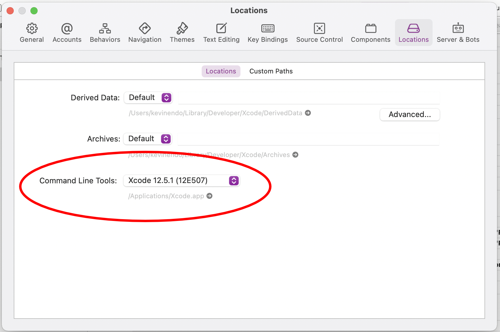
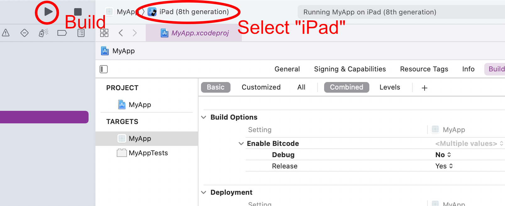

# React Native / Native Module Survey

## Requirements

1. Node: v16.6.1~ (brew install node)
2. Xcode (apple store)
3. Xcode command line tools
4. watchmen: 2022.08.29.00~ (brew install watchman)
5. pod: 1.11.3 (sudo gem install cocoapods)

---
&nbsp;
## Install dependencies
```bash
# directory: ReactNativeSurvey/
$ npm install

# directory: ReactNativeSurvey/ios/
$ pod install --repo-update
```

## Xcode Settings
### &emsp; Open Xcode

### &emsp; &emsp; 1. select "Open a project or file".
### &emsp; &emsp; 2. select "ReactNativeSurvey/ios/".

### &emsp; &emsp; 3.General > Deployment info > "iPad".


&nbsp;

### &emsp; &emsp; 4. Build Settings > Deployment.


&nbsp;

### &emsp; &emsp; 5. Preferences > Locations > Command line tools.


&nbsp;

### &emsp; &emsp; 6. Build

&nbsp;



&nbsp;
---
&nbsp;

## Run
### &emsp; Step 1: Start Metro
```bash
# directory: ReactNativeSurvey/

$ npx react-native start
```

### &emsp; Step 2: Start your application
```bash
# directory: ReactNativeSurvey/

# default device
$ npx react-native run-ios

# iPad simulator
$ npx react-native run-ios --simulator="iPad (8th generation)"
```
